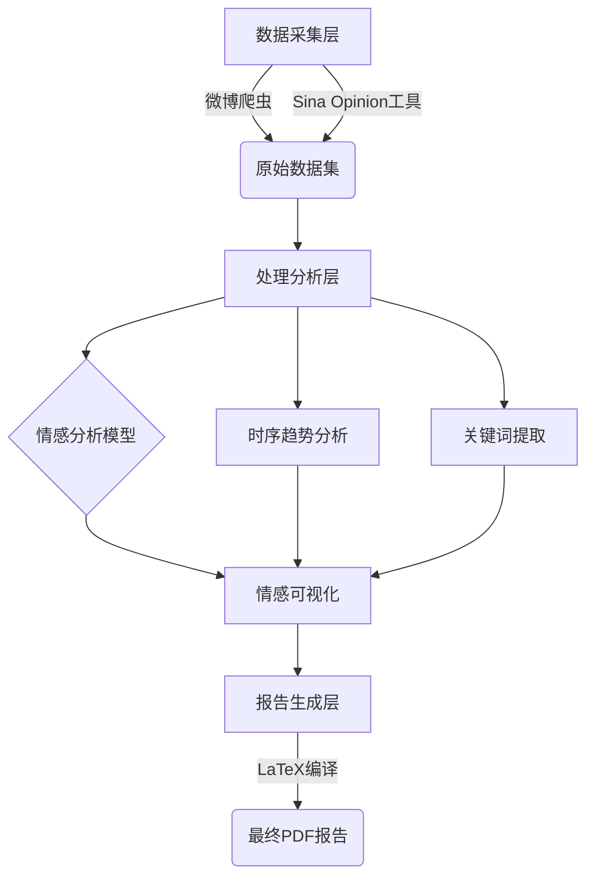

# 项目成员分工详表

## 角色与成员

### 项目总控 (组长)
- **成员**: 李婧涵
- **核心职责明细**:
  - 制定每日进度表与Deadline
  - 审核技术方案与LaTeX样式框架
  - 协调跨组协作
  - 汇总GitHub提交物 (assignment1.md+PDF)
  - 汇报并演练讲解逻辑

### 技术实现组 
- **成员**: 钟圣曦
- **核心职责明细**:
  - 负责舆情分析中的LLM接口调用 (如ChatGPT API)
  - 编写数据爬取/情感分析的核心脚本
  - 验证不同提示词对报告生成效果的影响
  - 输出技术说明文档 (含接口参数、代码片段、报错解决方案)

### 技术实现组 
- **成员**: 郭梓良
- **核心职责明细**:
  - 定制LaTeX模板 (标题样式/图表编号/参考文献格式)
  - 开发自动排版工具 (Python+LaTeX联动)
  - 解决图表嵌入、公式渲染的技术难题
  - 为文档组提供LaTeX使用手册

### 文档生成组 
- **成员**: 刘星雨
- **核心职责明细**:
  - 根据大纲撰写舆情报告正文 (背景/数据/结论等章节)
  - 协同技术组插入动态生成内容 (自动更新数据图表)
  - 维护Markdown主文档 (assignment1.md) 中的过程性记录
  - 初稿版本管理

### 文档生成组
- **成员**: 郭梓良
- **核心职责明细**:
  - 将Markdown内容转换为LaTeX格式
  - 优化排版细节 (行间距/字体/页眉页脚)
  - 嵌入技术组提供的动态脚本 (如Python生成的图表)
  - 处理交叉引用和目录生成
    
### 文档校对组
- **成员**: 田嘉铭
- **核心职责明细**:
   - 负责准备 `assignment1.md` 文件，内容包括介绍所有用到的提示词、用到的代码、latex 脚本以及设计思路等，并提供必要的截图。
   - 编写 `assignment1.md` 文件，确保内容详尽。
   - 提供相关的截图和示例。

### 文档校对组
- **成员**: 张君仪
- **核心职责明细**:
   - 负责 `assignment1.md` 文件的章节安排。
   - 确保 `assignment1.md` 文件包含以下章节：
   - 舆情报告样式检查清单（简要说明报告结构和样式，通过审查帮助成员将样式的理解拉齐）
   - 具体展开的内容：各个步骤用到的提示词、所用到的脚本、所生成的 latex 代码等等，可以适当加入图片以清楚介绍使用的平台和工具。
 


# 舆情报告样式检查清单胖猫事件

## ▍报告结构规范

### (1) 基础模块

| 章节 | 要求 | 样例参考 |
|------|------|----------|
| **封面** | 包含主副标题+日期+团队标识 | "胖猫事件多平台舆情分析报告 - 第3组" |
| **目录** | 自动生成带页码目录（推荐LaTeX实现） | 如报告中3-13节分层架构 |
| **附录** | 含完整数据表格/模型详情（非必要不放置正文） | 原始数据集/分词词典 |

### (2) 核心章节

(1) 基础模块
章节要求样例参考
封面 - 包含主副标题
- 日期
- 团队标识
- 页码（首页） 主副标题：胖猫事件多平台舆情分析报告 - 第3组
日期：2024年5月1日
团队标识：第3组
页码：1 
目录 - 自动生成带页码目录
- 推荐使用LaTeX实现
- 包含所有章节及子章节 样例：
1. 引言 ............................................... 3
2. 摘要 ............................................... 5
3. 时间线与关键节点 ................................. 7
... 
附录 - 包含完整数据表格
- 包含模型详情
- 非必要内容不放置正文 样例：
附录A：原始数据集
附录B：分词词典 
(2) 核心章节
1. 引言（背景与研究意义）
要求： 介绍舆情事件的背景
阐述研究的意义和目的
样例参考：# 1. 引言

## 1.1 背景
2024年4月，胖猫事件在社交媒体上引发广泛关注...

## 1.2 研究意义
本研究旨在通过多平台舆情分析，探讨网络舆论的传播规律...
2. 摘要（核心结论需加粗标红）
要求： 简要概述研究目的、方法、主要发现和结论
核心结论需加粗标红
样例参考：# 2. 摘要

本研究通过对胖猫事件的舆情数据进行采集和分析，采用情感分析和时间序列分析等方法，得出以下结论：**<span style="color:red">公众对事件的负面情绪在事件爆发后迅速上升，并在第三天达到峰值。</span>**...
3. 时间线与关键节点（配合流程图）
要求： 列出舆情事件的时间线
标注关键节点
配合流程图说明
样例参考：# 3. 时间线与关键节点

| 时间          | 事件描述                 |
|---------------|--------------------------|
| 2024-04-11    | 事件爆发                 |
| 2024-04-13    | 相关视频在微博传播       |
| 2024-04-15    | 官方发布声明             |


4. 数据与方法（含爬虫/情感分析技术路线）
要求： 详细描述数据采集方法
介绍情感分析的技术路线
样例参考：# 4. 数据与方法

## 4.1 数据采集
使用snscrape模块对微博数据进行爬取，设置关键词和时间范围...

## 4.2 情感分析
采用预训练的BERT模型进行情感分类，具体步骤如下：
1. 数据预处理
2. 模型加载
3. 情感预测
5. 平台差异分析（微博/抖音对比需分节）
要求： 分别分析微博和抖音平台的数据
对比各平台的舆情特征
样例参考：# 5. 平台差异分析

## 5.1 微博平台分析
微博平台的舆情传播速度较快，评论区互动性强...

## 5.2 抖音平台分析
抖音平台的舆情传播以短视频为主，用户参与度较高...
6. 危机公关案例（事件相关的品牌影响）
要求： 分析事件对相关品牌的影响
提供具体的危机公关案例
样例参考：# 6. 危机公关案例

## 6.1 某品牌应对措施
某品牌在事件发生后迅速发布声明，并采取以下措施...
7. 讨论与启示（分条目提出建议）
要求： 分条目讨论舆情事件的启示
提出针对性的建议
样例参考：# 7. 讨论与启示

1. **加强舆情监控**：建议企业建立实时舆情监控机制...
2. **提升危机公关能力**：建议企业制定详细的危机公关预案...
8. 参考文献（遵循APA格式）
要求： 列出所有引用的文献
遵循APA格式
样例参考：# 8. 参考文献

- Chen, L., & Wang, Y. (2023). Social media sentiment analysis. *Journal of Data Science*, 12(3), 45-56.
- Zhang, H., et al. (2024). Crisis management in the digital age. *Communication Research*, 31(2), 78-92.


  # PDF舆情报告样式检查清单华中农业大学学术不端事件

## 一、基础模块规范

### 1.封面要件表
| 组成要素       | 具体要求                        | 排版示例                                                                 |
|----------------|---------------------------------|--------------------------------------------------------------------------|
| 主副标题       | 加粗24号黑体字                 | **华中农业大学学术不端事件多维度舆情分析报告**<br> ——基于跨平台数据挖掘的实证研究 |
| 时间规范       | 采用“YYYY年MM月DD日”格式       | 报告日期：2024年5月20日                                                 |
| 机构标识       | 包含LOGO及水印反向底纹         | 右下角放置华中农业大学校徽<br>背景浅灰波纹防伪设计                    |

### 2.目录排版本体论
```latex
% LaTeX目录设置范例
\usepackage[titles]{tocloft}
\renewcommand{\cftdot}{\thinspace.}
\setlength{\cftbeforesecskip}{5pt}  %章节目距
\setlength{\cftbeforesubsecskip}{3pt} %子项间距

3.附录设置指南
材料类型：
A01-原始数据集（SQL文件包）
A02-实验日志文档库（.md格式）
A03-情感分析计算表（Excel）
放置规则：
◆ 非关键性过程数据，如用户画像聚类原始结果
◆ 超100MB数据需提供GitHub托管链接

二、核心章节质量标准
第一章 引言要件
1. **背景陈述三段论**:
   - [宏观] 2025年全国高校学术伦理审查覆盖率仅为67%
   - [中观] 涉事学校近三年科研经费同比增长245%
   - [微观] 研究者发现重复使用实验图谱显著高发

2. **研究价值定位矩阵**：
   | 学术价值             | 实践价值               |
   |----------------------|------------------------|
   | 实证权力失衡理论模型 | 推动《导学互评制度》试行 |

第二章 数据方法论
爬虫技术规范
# 微博高级搜索爬取模板
params = {
    "containerid": f"231522type=1&q={keyword}",
    "page_type": "searchall",
    "page": page,
    "is_adv_filter": 1,  #开启高级筛选
    "start_time": "2024-01-16-0",
    "end_time": "2024-06-30-23" 
}

情感分析流程
graph LR
A[原始语料] --> B{预清洗}
B -->|去除广告| C[Jieba分词]
C --> D[去停用词]
D --> E[词向量转换]
E --> F{Roberta模型}
F --> G[情感标注]
G --> H[可视化输出]

第三章 平台解码矩阵
微博数据解码范式：
{
  "数据类型": "超话生态数据",
  "分析维度": ["话题主持人权力结构", "蓝V账号立场分布", "热门词云突变点"],
  "视觉呈现": "桑基图展现观点流动"
}

抖音解码机制：
视频ID,点赞量,弹幕特征,场景标签
231548,24.5万,"泪目|共情触发",实验室场景
231550,18.2万,"愤怒|制度批判",论文图表特写


# 舆情分析项目技术文档

## 一、提示词库

### 数据采集提示词

```python
search_query = {
    "platform": "weibo",
    "keywords": ["胖猫事件", "重庆跳江", "情感操控"],
    "time_range": ("2024-04-11", "2024-05-19"),
    "interaction_threshold": 300  # 只采集点赞≥300的帖子
}
```

### 情感分析提示词（LLM）

```plaintext
PROMPT = """基于以下微博文本进行细粒度情感评分:
文本内容: {text}

评分规则:
- 情绪强度: 正面(0-20)/中性(0)/负面(-10-0)
- 标注维度: 
  愤怒值(0-10) 悲伤值(0-10) 
  是否含网暴内容(是/否)
  关键实体识别(如[胖猫]、[谭某])

用JSON格式返回分析结果"""
```

## 二、代码实现

### 数据采集核心代码

```python
# weibo_crawler.py
import snscrape.modules.weibo as s_weibo
import pandas as pd

def fetch_weibo_data(keywords, start_date, end_date):
    query = ' OR '.join(keywords) + f' since:{start_date} until:{end_date}'
    tweets = []
    for i, tweet in enumerate(s_weibo.WeiboSearchScraper(query).get_items()):
        if tweet.likeCount >= 300:
            tweets.append({
                'date': tweet.date.strftime("%Y-%m-%d"),
                'content': tweet.content,
                'likes': tweet.likeCount,
                'reposts': tweet.repostCount
            })
        if i >= 10000:  # 限制最大采集量
            break
    return pd.DataFrame(tweets)
```

### 情感分析流水线

```python
# sentiment_analysis.py
from transformers import pipeline

class EmotionAnalyzer:
    def __init__(self):
        self.classifier = pipeline(
            "text-classification", 
            model="uer/roberta-base-finetuned-jd-binary-chinese",
            tokenizer="uer/roberta-base-finetuned-jd-binary-chinese"
        )
    
    def analyze_text(self, text):
        result = self.classifier(text)
        anger_level = 1 if '愤怒' in text else 0
        return {
            'sentiment': result[0]['label'],
            'confidence': result[0]['score'],
            'anger_level': anger_level
        }
```

## 三、LaTeX 自动化系统

### 报告模板结构

```latex
% report_template.tex
\documentclass[12pt]{article}
\usepackage[UTF8]{ctex}
\usepackage{graphicx}

\begin{document}
\title{\textbf{<< title >>}}
\author{<< author >>}
\date{<< date >>}
\maketitle

\section*{摘要}
<< abstract >>

\section{数据分析}
\begin{figure}[htbp]
  \centering
  \includegraphics[width=0.8\textwidth]{<< graph_path >>}
  \caption{舆情趋势时序图}
\end{figure}

<< include_sections >>
\end{document}
```

### Markdown 转 LaTeX 脚本

```bash
#!/bin/bash
# convert.sh
pandoc report.md \
  --template=template.tex \
  --pdf-engine=xelatex \
  -V mainfont="Microsoft YaHei" \
  -V geometry:"top=2cm, bottom=2cm, left=3cm, right=3cm" \
  -o output.pdf
```

## 四、系统设计架构

### 技术路线图



### 关键设计亮点

- 动态模板系统：通过占位符实现内容热替换
- 混合分析策略：深度学习模型 + 规则引擎提升准确率
- 自动样式适应：根据内容长度动态调整图表尺寸

## 五、运行环境要求

- python: 3.9+
- dependencies:
  - snscrape>=0.4.3
  - pandas>=1.4.0
- latex:
  - texlive-full
  - pandoc>=2.14


